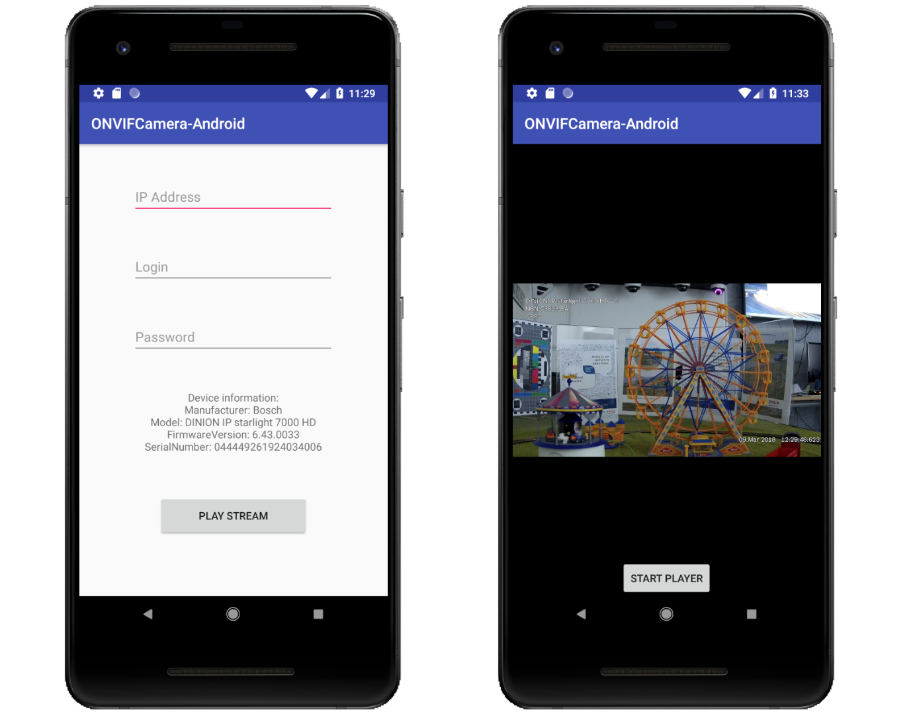

# ONVIFCameraAndroid
Example on how to connect to an ONVIF camera on Android, and dependency to ease the development of an ONVIF Android app.




Install with Gradle:

```gradle
implementation 'com.squareup.okhttp3:okhttp:3.10.0'
implementation 'com.rvirin.onvif:onvifcamera:1.1.5'
```

## Connect to an Onvif camera

```kotlin
currentDevice = OnvifDevice("IP_ADDRESS:PORT", "login", "pwd")
currentDevice.listener = this
currentDevice.getDeviceInformation()
```
## Retrieve the stream URI

```kotlin
currentDevice = OnvifDevice("IP_ADDRESS:PORT", "login", "pwd")
currentDevice.listener = this
currentDevice.getDeviceInformation()

override fun requestPerformed(response: OnvifResponse) {
        Log.d("ONVIF", "Request ${response.request.type} performed.")
        Log.d("ONVIF","Succeeded: ${response.success}, 
		  message: ${response.parsingUIMessage}")

        if (response.request.type == GetDeviceInformation) {
            currentDevice.getProfiles()

        } else if (response.request.type == GetProfiles) {
            currentDevice.getStreamURI()

        } else if (response.request.type == GetStreamURI) {
            Log.d("ONVIF", "Stream URI retrieved: ${currentDevice.rtspURI}")
        }
    }
```
